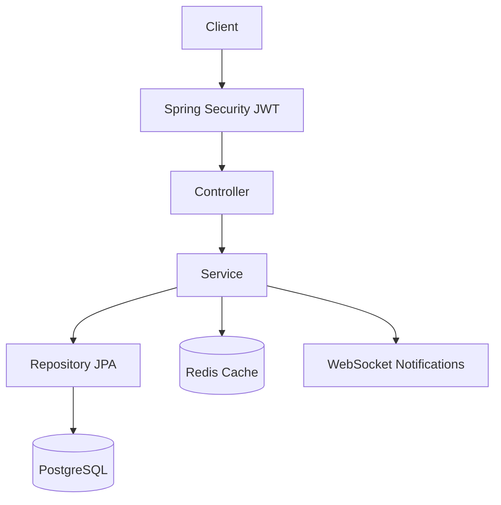

<div align="center">
  
  
  <br/>
  
  # 🏆 Pitch Management System
  
  **A platform connecting pitch owners and players directly, integrating a smart matchmaking algorithm and automated payment management.**

[](https://spring.io/projects/spring-boot)
[](https://reactjs.org/)
[](https://www.postgresql.org/)
[](https://redis.io/)
[](https://stripe.com/)

</div>

---

## ✨ Features

- **Role-based access control (Owner / Staff / Customer)**
- **Real-time notifications via WebSocket**
- **Pitch booking with conflict detection & pagination**
- **JWT authentication with refresh token flow**
- **Audit logging & schema migration via Flyway**

## 🏗 Architecture



## 🛠 Tech Stack

| Layer     | Technology                          |
| :-------- | :---------------------------------- |
| Backend   | Java 21, Spring Boot 3.2, MapStruct |
| Security  | Spring Security, JWT                |
| Database  | PostgreSQL, Hibernate, Flyway       |
| Cache     | Redis (Dockerized)                  |
| Real-time | WebSocket (STOMP)                   |

## 🚀 Getting Started

**Prerequisites:**

- **Docker & Docker Compose** (Recommended)
- **Java 21** (Only needed if running backend locally)
- **Node.js 20+** (Only needed if running frontend locally)

---

### 🐳 Option 1: Quick Start with Docker (Recommended)

To build and run the entire stack (Backend, Frontend, and Redis) all at once:

1. **Clone the repository:**

   ```bash
   git clone https://github.com/ducpham211/pitch-management-system.git
   cd pitch-management-system
   ```

2. **Configure Backend environment:**
   Create a `.env` file inside the `backend/` directory and configure your Database connection (e.g., Supabase) and other credentials:

   ```env
   DB_URL=jdbc:postgresql://<host>:5432/postgres
   DB_USERNAME=postgres
   DB_PASSWORD=your_database_password
   JWT_SECRET=your_super_secret_key_for_jwt_auth_12345
   SUPABASE_URL=https://<project>.supabase.co
   ```

3. **Run the system:**
   At the project root directory, run:

   ```bash
   docker compose up -d --build
   ```

4. **Access the application:**
   - **Frontend:** [http://localhost:3000](http://localhost:3000)
   - **Backend API:** [http://localhost:8080](http://localhost:8080)

---

### 💻 Option 2: Manual / Local Development Setup

#### Step 1: Start Redis

The Backend requires Redis for local caching and lock management:

```bash
docker run -d -p 6379:6379 --name local-redis redis:latest
```

#### Step 2: Run the Backend (Spring Boot)

1. Navigate to the backend directory:
   ```bash
   cd backend
   ```
2. Create a `.env` file as shown in Option 1, but make sure to set:
   ```env
   REDIS_HOST=localhost
   ```
3. Run the backend service:
   ```bash
   ./mvnw clean install
   ./mvnw spring-boot:run
   ```

#### Step 3: Run the Frontend (React Vite)

1. Open a new terminal, navigate to the frontend directory:
   ```bash
   cd frontend
   npm install
   ```
2. Create a `.env` file inside the `frontend/` directory:
   ```env
   VITE_API_BASE_URL=http://localhost:8080/api
   VITE_WS_URL=http://localhost:8080/ws
   ```
3. Start the Vite development server:
   ```bash
   npm run dev
   # Open browser at http://localhost:5173
   ```

## ⚙️ Environment Variables

| Variable            | Description                     |
| :------------------ | :------------------------------ |
| `DB_URL`            | PostgreSQL connection           |
| `DB_USERNAME`       | Database user                   |
| `DB_PASSWORD`       | Database password               |
| `JWT_SECRET`        | JWT signing key                 |
| `REDIS_HOST`        | Redis host (default: localhost) |
| `STRIPE_SECRET_KEY` | Stripe Payment Key              |
| `SUPABASE_URL`      | Supabase API URL                |

## 📂 Project Structure

The system is divided into 2 sub-repositories (Monorepo-style) located in the same root directory:

### 1. Backend (`/backend`)

```text
backend/
├── src/main/java/com/example/backend/
│   ├── controller/     # Handles incoming Requests and returns Responses (REST API)
│   ├── service/        # Contains all core Business Logic
│   ├── repository/     # Interfaces for PostgreSQL communication (JPA/Hibernate)
│   ├── security/       # Spring Security configuration & JWT processing
│   ├── dto/            # Data Transfer Objects for receiving/sending data (with MapStruct)
│   ├── entity/         # Classes mapping directly to Database tables
│   └── exception/      # Global Exception handling (ControllerAdvice)
└── db/migration/       # Flyway SQL scripts for database versioning
```

### 2. Frontend (`/frontend`)

```text
frontend/
├── src/
│   ├── components/     # Shared UI components (Buttons, Modals, Navbar...)
│   ├── pages/          # Main pages (Home, Booking, MatchFinder, Dashboard...)
│   ├── hooks/          # Custom React Hooks (e.g., useAuth, useWebSocket)
│   ├── services/       # API call files to the Backend (Axios instances)
│   ├── store/          # Global State management (Redux / Zustand)
│   └── utils/          # Utility functions for formatting dates, currency, etc.
└── tailwind.config.js  # UI framework configuration
```

## 🔌 API Overview

| Method | Endpoint             | Description         | Auth |
| :----- | :------------------- | :------------------ | :--: |
| POST   | `/api/auth/login`    | Login, get JWT      |  ❌  |
| GET    | `/api/fields`        | List fields (paged) |  ✅  |
| POST   | `/api/bookings`      | Create booking      |  ✅  |
| GET    | `/api/bookings/{id}` | Booking detail      |  ✅  |

## ✍️ Author

**Pham Viet Duc** - [GitHub](https://github.com/ducpham211)

- [LinkedIn](https://www.linkedin.com/in/viet-duc-pham-898459337/)
